# Dataguru Frontend

Application web responsive pour Dataguru, permettant l'accès et la visualisation des données d'entreprises.

## Technologies utilisées

- **Framework** : Next.js
- **Styles** : TailwindCSS & SCSS
- **Authentification** : Auth.js avec OAuth
- **Base de données** : PostgreSQL avec Prisma ORM
- **Visualisation** : Recharts
- **Internationalisation** : i18n
- **Thème** : Light/Dark mode

## Fonctionnalités principales

### 1. Authentification & Sécurité

- Système de connexion complet (email/mot de passe)
- OAuth Provider intégré
- OAUth Google et Github
- Gestion des rôles (user/admin)
- Système de récupération de mot de passe
- Confirmation d'email par lien
- Gestion des sessions et tokens
- Pages sécurisées selon les rôles

### 2. Compte Utilisateur

#### Profile
- Informations personnelles
 - Prénom
 - Nom
 - Entreprise
 - Email

#### License
- Type d'abonnement : Trial
- Couverture géographique : Monde
- Vues entreprises quotidiennes : Illimitées
- Téléchargements quotidiens : Illimités

### 3. Dashboard

#### Interface principale
- Responsive
- Menu de navigation par onglets
- Dropdown compte utilisateur
- Toggle thème Light/Dark
- Barre de recherche entreprises
- Liste des entreprises disponibles (API) - Mocké pour le moment

### 4. Administration

Réservé aux administrateurs :
- Gestion des utilisateurs
 - Filtrage
 - Tri
 - Pagination
- Modification des rôles utilisateurs

### 5. Profil Entreprise

#### Informations disponibles
- Description générale
- Informations principales
- Ajustements principaux

#### Onglets d'analyse
- Snapshot
- Historical Infos
- Invisible Capital
- Breakdown
- Economic Life
- Leadership
- Point in Time

#### Visualisation
- Graphiques Recharts
- Données mockées pour développement

## Installation

```bash
# Installation des dépendances
npm install

# Configuration de la base de données
npx prisma generate
npx prisma db push

# Lancement en développement
npm run dev

# Build production
npm run build
npm start
```

## Thèmes

Les thèmes Light et Dark sont configurables dans les paramètres utilisateur et persistent via localStorage.

## Sécurité

* Accès sécurisé à la base de données via Prisma
* Routes protégées par authentification
* Validation des données entrantes
* Protection CSRF
* Sessions sécurisées

## Aperçu

### Recherche d'entreprises
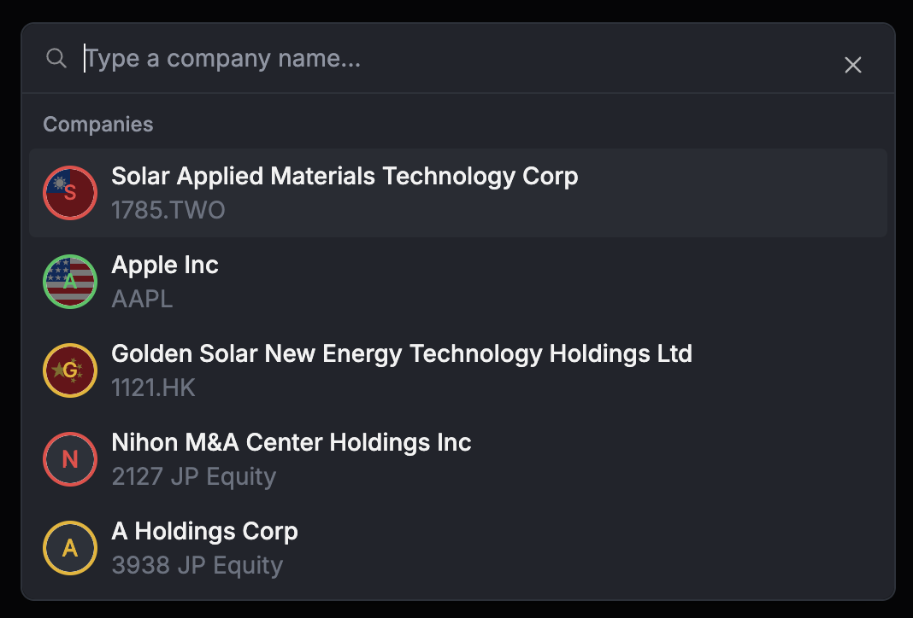

### Entreprise non enregistré
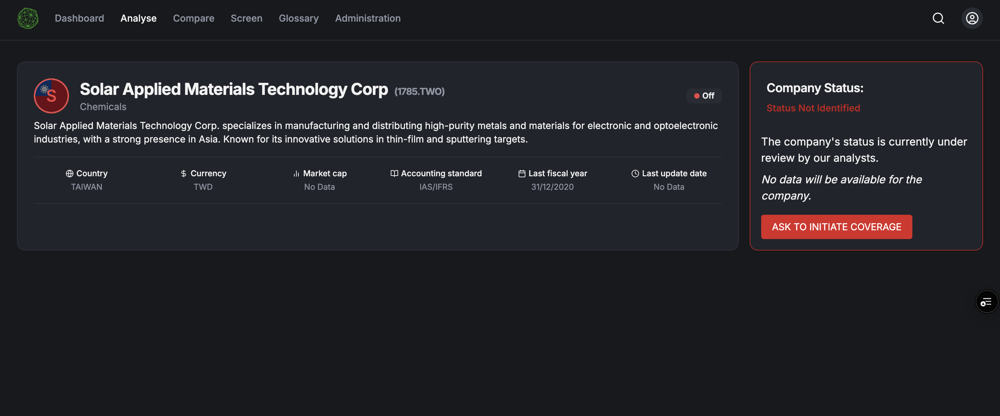

### Entreprise en attente
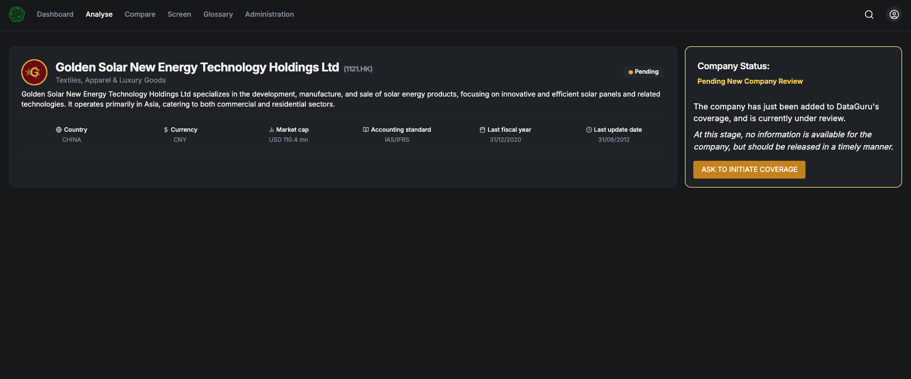

### Authentification
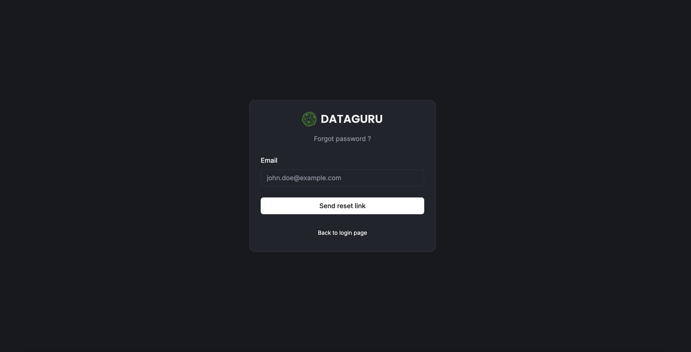

### Dashboard
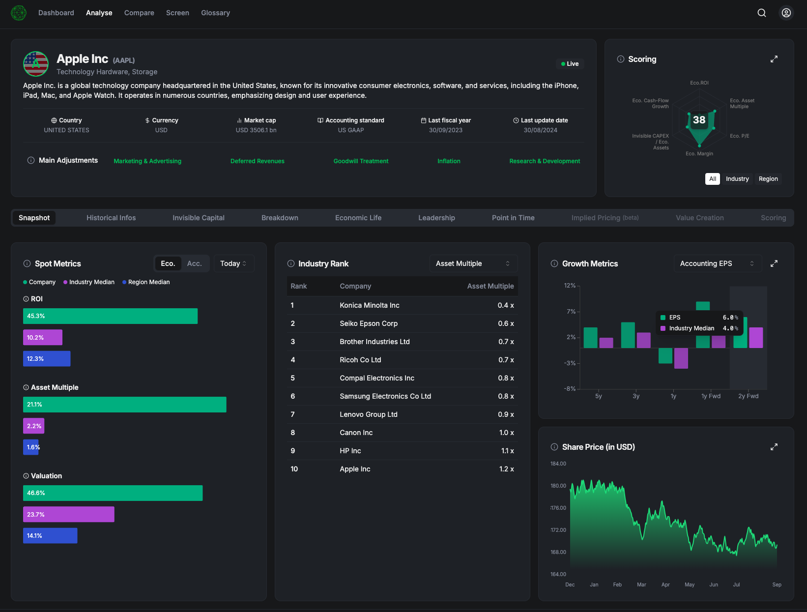

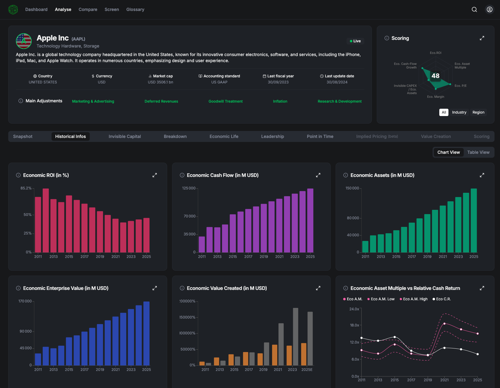

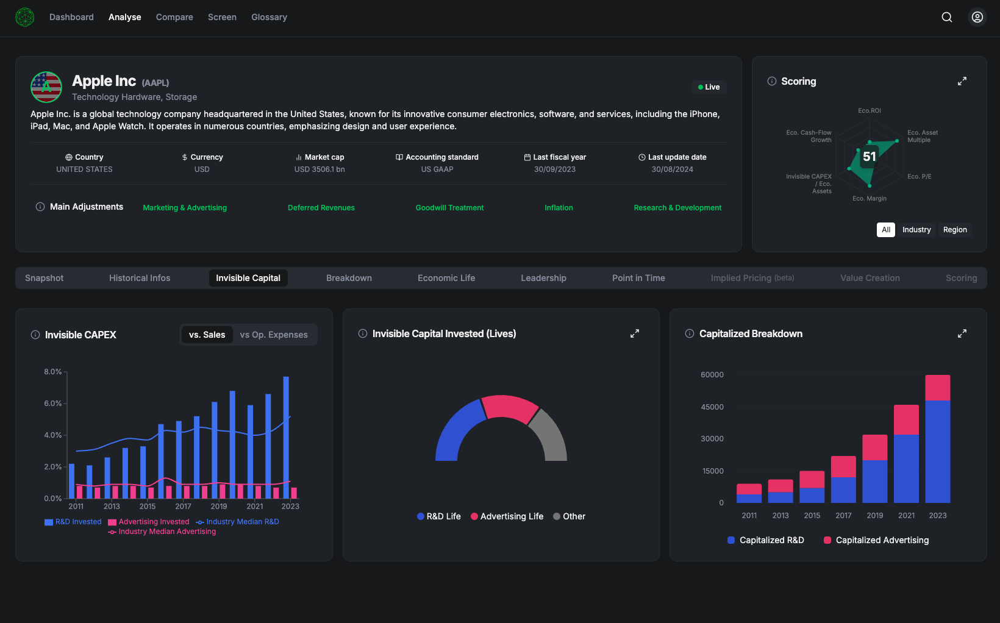

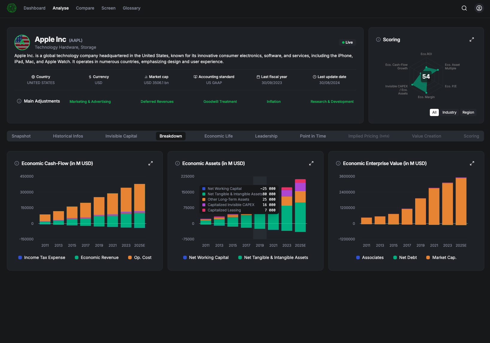

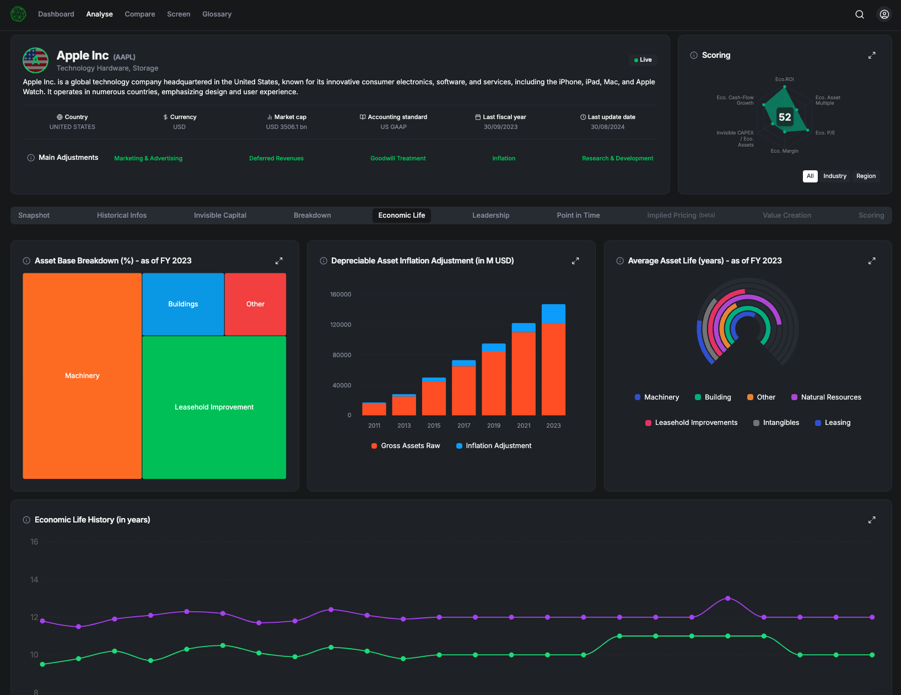

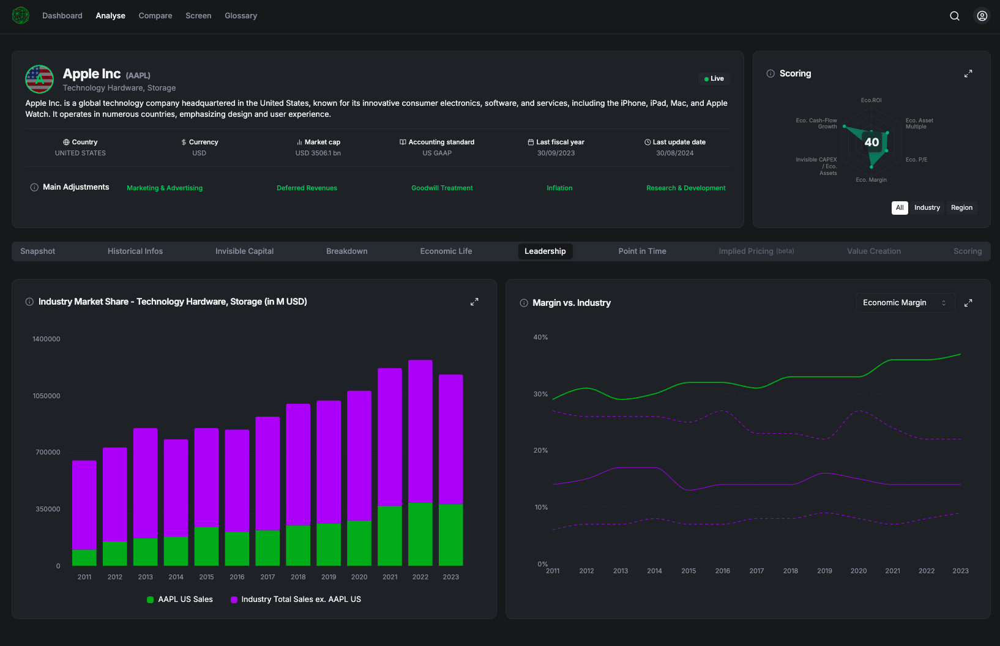

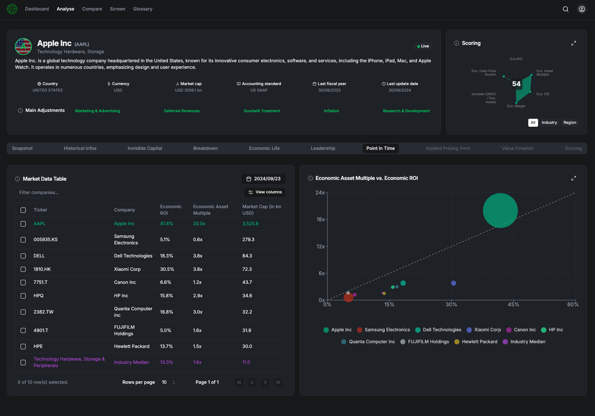

### Admin - Gestion utilisateurs
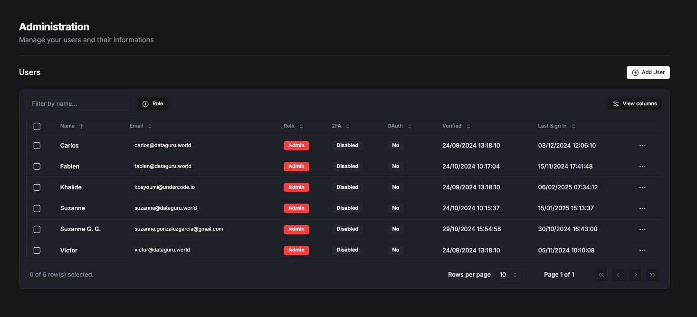
